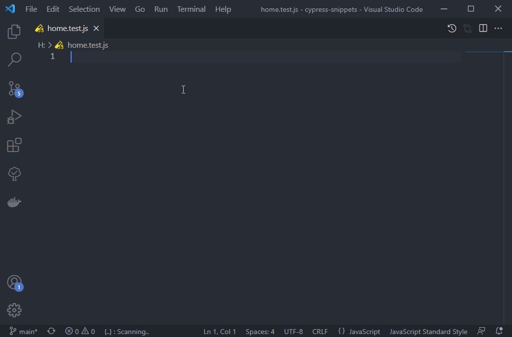

# VS Code Cypress Snippets

This extension includes the most common cypress snippets. If you like it, please leave your Rating & Review and share it with your friends.

## Installation

In order to install an extension, you need to open the Extensions Palette (`Ctrl + Shift + X` or `Cmd ⌘ + Shift + X`). There you have either the option to show the already installed snippets or install new ones.

[Visual Studio Marketplace](https://marketplace.visualstudio.com/items?itemName=CliffSu.cypress-snippets)

## Supported Languages (file extensions)

- JavaScript (.js)
- TypeScript (.ts)
- JavaScript React (.jsx)
- TypeScript React (.tsx)

## Snippets

### Mocha Snippets

| Snippet  | Code                                                   |
| -------- | -------------------------------------------------------|
| `dsb`    | describe('', () => {  });                        |
| `ctx`    | context('', () => {  });                         |
| `spe`    | specify('', () => {  });                         |
| `it`     | it('', () => {  });                              |
| `bf`     | before('', () => {  });                          |
| `bfe`    | beforeEach('', () => {  });                      |
| `af`     | after('', () => {  });                           |
| `afe`    | afterEach('', () => {  });                       |

**[⬆ Back to top](#Installation)**

### Cypress Snippets

| Snippet  | Code                                                   |
| -------- | -------------------------------------------------------|
| `cyvt`   | cy.visit('');                                          |
| `cygt`   | cy.get('');                                            |
| `cyfd`   | cy.get('').find('');                                   |
| `cyft`   | cy.get('').first('');                                  |
| `cylt`   | cy.get('').last('');                                   |
| `cyte`   | cy.get('').type('');                                   |
| `cyck`   | cy.get('').click();                                    |
| `cycs`   | cy.contains('');                                       |
| `cywt`   | cy.wait('');                                           |
| `cyul`   | cy.url().should('', '');                               |
| `cylg`   | cy.log('');                                            |
| `cype`   | cy.pause();                                            |
| `cydg`   | cy.debug();                                            |
| `cyst`   | cy.screenshot('');                                     |
| `cyvpt`  | cy.viewport();                                         |

**[⬆ Back to top](#Installation)**

## Change Log

See the [CHANGELOG](./CHANGELOG.md) for details about the changes in each version.

## License

[MIT](./LICENSE)
